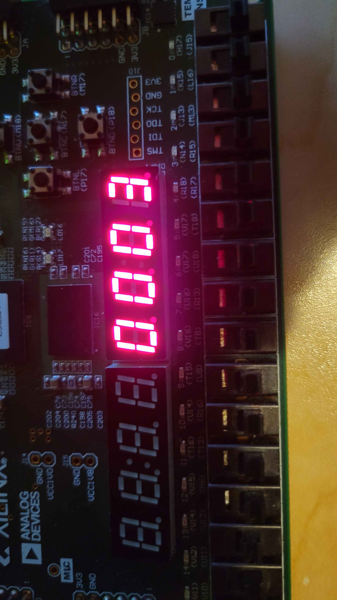
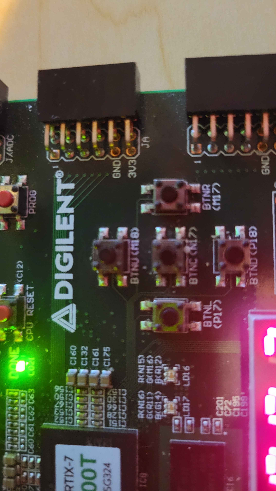
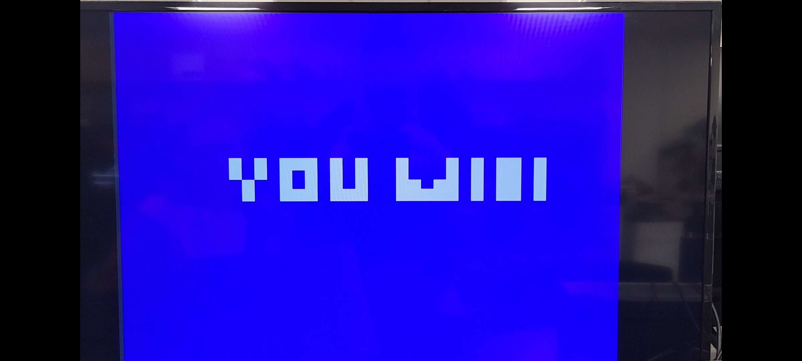

# Mini-Golf
Repository for a mini golf game based on the NEXYS A7-100T FPGA. \
We have a small poster presentation PDF made that can be found in our SourceFolder if interested

## Project Behavior
### Software
The current version of our mini golf game features 5 levels. The objective is to beat every level. With every stroke that is made, the counter on the board's built in 7-segment display will increase by 1 and is displayed in hexadecimal. You can also try to get a low score by winning in the lowest number of "strokes". When the ball collides with the hoel at the end of each level, the software will update the level counter and add 1 to it. When the program detects that the level counter has changed, it will change the scene to the next level. Once you reach the win screen after the last level, you can reset the entire program back to the first level and with a clear score. At it's core, this functions as a Finite State Machine, where the states are represented as levels.
### Hardware Needed
1. NEXYS A7-100T FPGA\
Board\

Board Box\

3. A device that can run Vivado
4. Micro-USB to USB cable
5. External display
6. VGA, USB, and AUX to HDMI adapter\
Adapter\

## Steps to Run
1. With a new project in Vivado, add all of the supplementary files given in this repository as sources (+the one .xdc as a constraint)
2. Connect a NEXYS A7-100T FPGA to your device
3. Connect the NEXYS board to an external display using the VGA to HDMI adpater
4. Click "Run Synthesis"
5. Click "Run Implementation"
6. Click "Generate Bistream"
7. Once this process is complete, click "Program Device", let the system auto-connect, and the game should appear on your display

## Inputs and Outputs
### Inputs
Our project uses the 5 buttons labelled "BTLU", "BTNR", "BTNL", "BTND", and "BTNC". The first 4 buttons listed move the purple shot cursor up, down, left, and right to change the power and trajectory of the ball. \
7-Segment Counter \

Buttons \

### Outputs
The 7-segment counter that is built into the NEXYS board is used to keep score. As previously stated, it increases by 1 with every stroke made. We also used the video output on the board to actually show the game on an external display.

## Summary
The initial idea came from the idea of the "Pong" lab of thinking how similar it reminded us of a top down golf game, similar to the top down perspective of Mario Golf for the Game Boy Color: that was the spark to our "eureka moment."

As so, we were able to reuse some of the files from the "Pong" lab with very minimal changes. The vga_sync, leddec16, cl_wiz_0, clk_wiz_o_clk_wiz, and minigolf.xdc constraint remained very similar to their original versions from the in-class "Pong" lab, with some modifications to some in placement of the increased controls and colors)

The game itself is housed in the main minigolf.vhd, with it housing the logic to accurately transition through levels. Each individual level file houses the geometry and interactions/calculations per level (each level individually redraws and recalculates each obstacle, even if obstacle is shared between levels)

## Modifications
We originally took code from the "Pong" lab from our Digital System Design class.
It features a simple ball and bar where the ball bounces endlessly around the screen.
Should the ball hit the bar, it will bounce off of it in the opposite direction.
We took these physics as a base for our "golf ball" and added a lot onto it.
Our main addition was a shot marker represented by a purple circle.
This changed the shot speed and distance as well as the vector (direction) that the ball would go in.
We also added obstacles around the levels with their own collision as opposed to just having borders around the screen.

## Project in Action
Video recording: https://youtu.be/8sf0UF7UczM

### Levels

Level 1\

Level 2\

Level 3\

Level 4\

Level 5\

Win Screen\

## Conclusion

### Responsibilities
Aaron Sprigle:
- Managed the majority of the poster and presentation
- Transcribed the majority of project to the GitHub repository
- Assisted in modifications of prior pong files
- Helped create the win screen post-level 5

Austin Schlake:
- Created the motion of ball and obstacle interactions
- Manhandled getting the slopes under manageable control
- Implemented the layouts and interactions for each level.
- Contributed to GitHub repository

### Timeline
- 12/4: Transitory Modifications of reliable Pong project files
- 12/6: Finalizing Motion of the Ball + Interaction with walls and hole
- 12/8-12/10: Architectures of levels 1-5 (main gameplay loop complete)
- 12/11-12/13: The Weekend of trying to fix the Slopes
- 12/14: Poster Presentation & Live Demonstration

### Challenges
- Most difficult challenge was programming slopes.
  - Mimicking regular motion for regular shots was easy enough. Stronger the shot, have ball move more pixels/frame, stop when reach the predetermined "time limit."
  - Programming slopes, objects that would alter the motion of the shot, became chaotic.
  - The two largest problems became either of the two slopes (the hills or the valleys) being too good at their jobs, rejecting or attracting the ball with such force that you wouldn't be able to overcome their pull regardless of how powerful the shot, or the slopes being too bad at their jobs and not doing anything to alter the ball's motion. Also trying to modify the motion calculations of the level (to try to fix the slopes) resulted in the ball's motion calculations being messed up.
- While it would've been preferred to find a remedy for this where they would work purely as intended. We found workarounds for both level 3 and 4. For level 3, the slopes still do attract and repel the ball to undesired severities, but after much tweaking: the severity of the slopes is manageable. For level 4, the motion of the ball did get messed up when trying to program the large slope. To remedy this, we expanded the range of the shot, so now you can essentially double the power of your shot compared to other levels to more reasonably reach the summit of the hill. 
