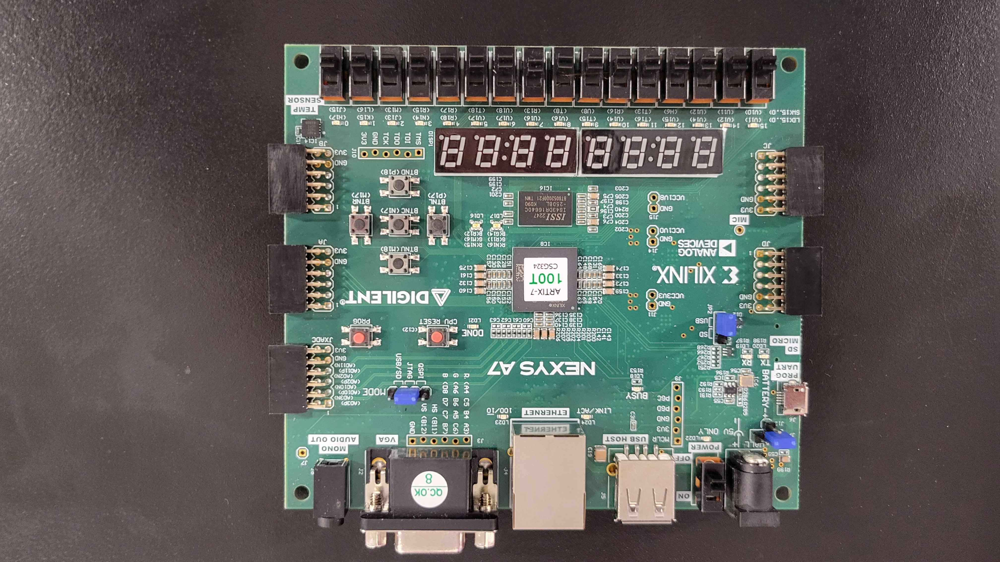
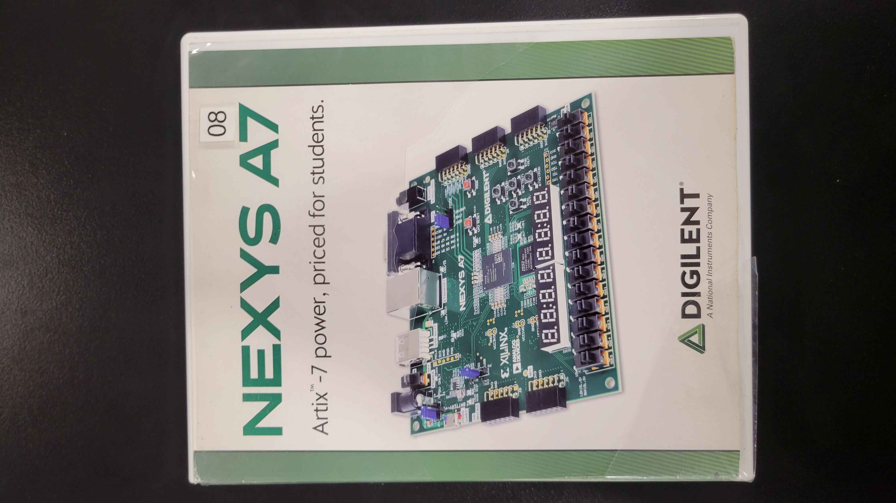
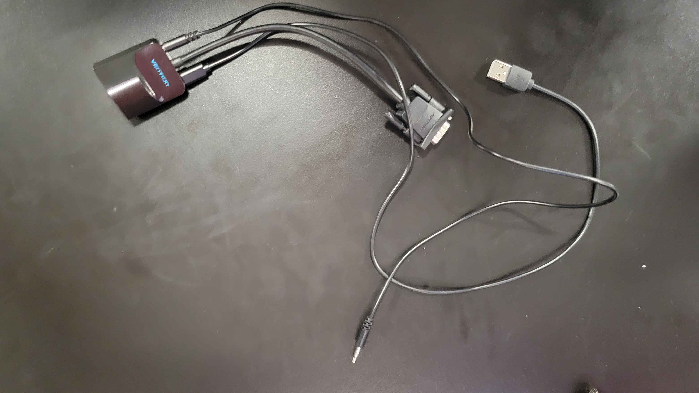
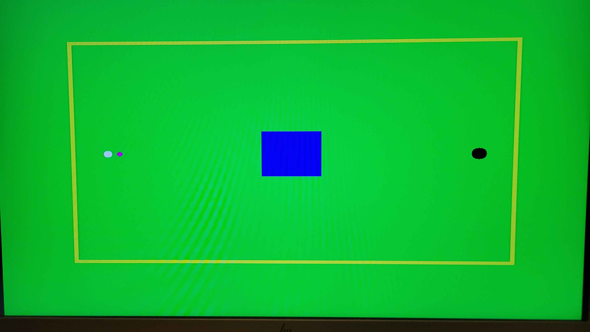
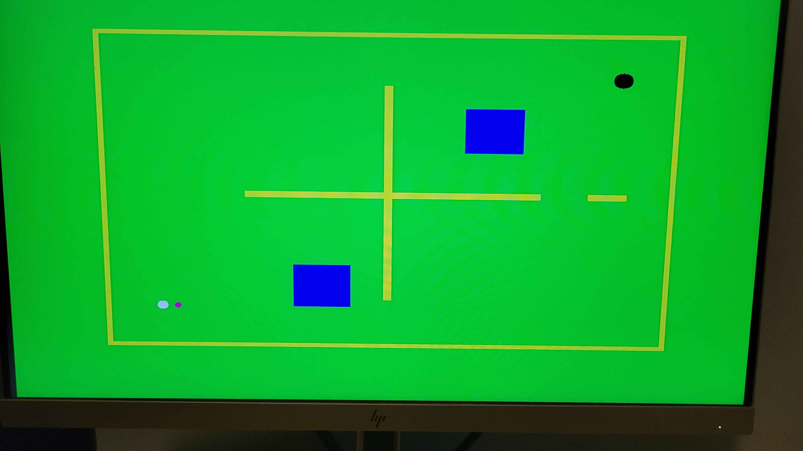
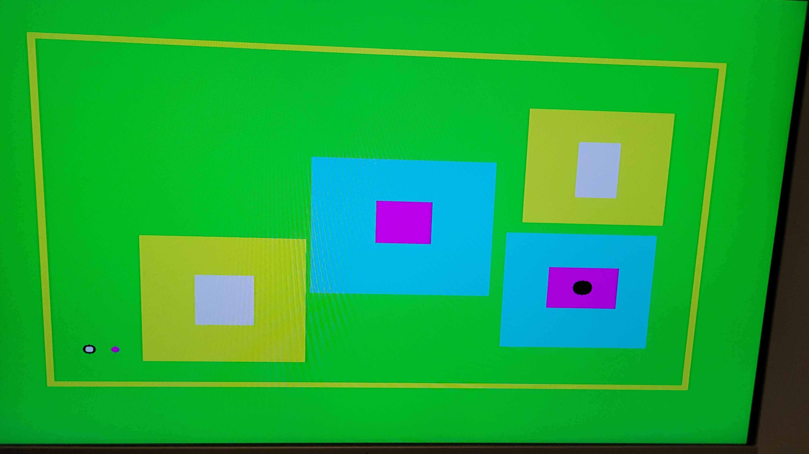
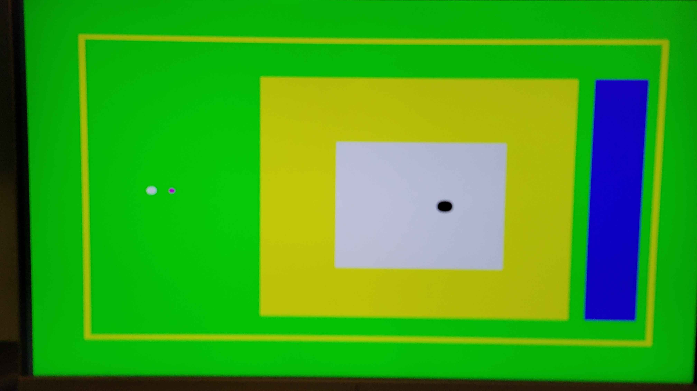
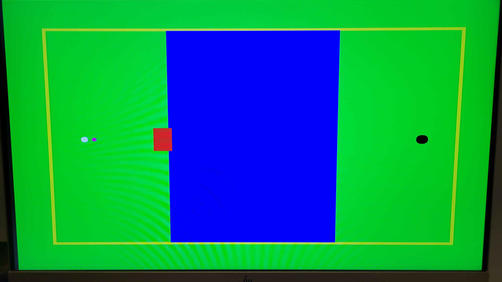

# Mini-Golf
Repository for a mini golf game based on the NEXYS A7-100T FPGA. 

## Project Behavior
### Software
The current version of our mini golf game features 5 levels. The objective is to beat every level. With every stroke that is made, the counter on the board's built in 7-segment display will increase by 1 and is displayed in hexadecimal. You can also try to get a low score by winning in the lowest number of "strokes". When the ball collides with the hoel at the end of each level, the software will update the level counter and add 1 to it. When the program detects that the level counter has changed, it will change the scene to the next level. Once you reach the win screen after the last level, you can reset the entire program back to the first level and with a clear score. At it's core, this functions as a Finite State Machine, where the states are represented as levels.
### Hardware Needed
1. NEXYS A7-100T FPGA\
Board\

Board Box\

3. A device that can run Vivado
4. Micro-USB to USB cable
5. External display
6. VGA, USB, and AUX to HDMI adapter\
Adapter\

## Steps to Run
1. With a new project in Vivado, add all of the supplementary files given in this repository as sources
2. Connect a NEXYS A7-100T FPGA to your device
3. Connect the NEXYS board to an external display using the VGA to HDMI adpater
4. Click "Run Synthesis"
5. Click "Run Implementation"
6. Click "Generate Bistream"
7. Once this process is complete, click "Program Device", let the system auto-connect, and the game should appear on your display

## Inputs and Outputs
### Inputs
Our project uses the 5 buttons labelled "BTLU", "BTNR", "BTNL", "BTND", and "BTNC". The first 4 buttons listed move the purple shot cursor up, down, left, and right to change the power and trajectory of the ball.
### Outputs
The 7-segment counter that is built into the NEXYS board is used to keep score. As previously stated, it increases by 1 with every stroke made. We also used the video output on the board to actually show the game on an external display.

## Summary

## Modifications
We originally took code from the "Pong" lab from our Digital System Design class.
It features a simple ball and bar where the ball bounces endlessly around the screen.
Should the ball hit the bar, it will bounce off of it in the opposite direction.
We took these physics as a base for our "golf ball" and added a lot onto it.
Our main addition was a shot marker represented by a purple circle.
This changed the shot speed and distance as well as the vector (direction) that the ball would go in.
We also added obstacles around the levels with their own collision as opposed to just having borders around the screen.

## Project in Action
Video recording: https://youtu.be/8sf0UF7UczM

### Levels

Level 1\

Level 2\

Level 3\

Level 4\

Level 5\

## Conclusion
